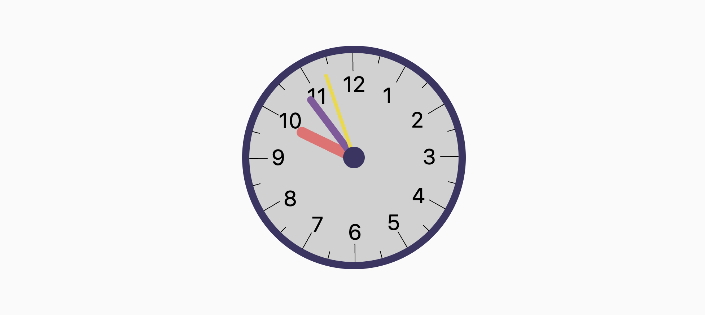
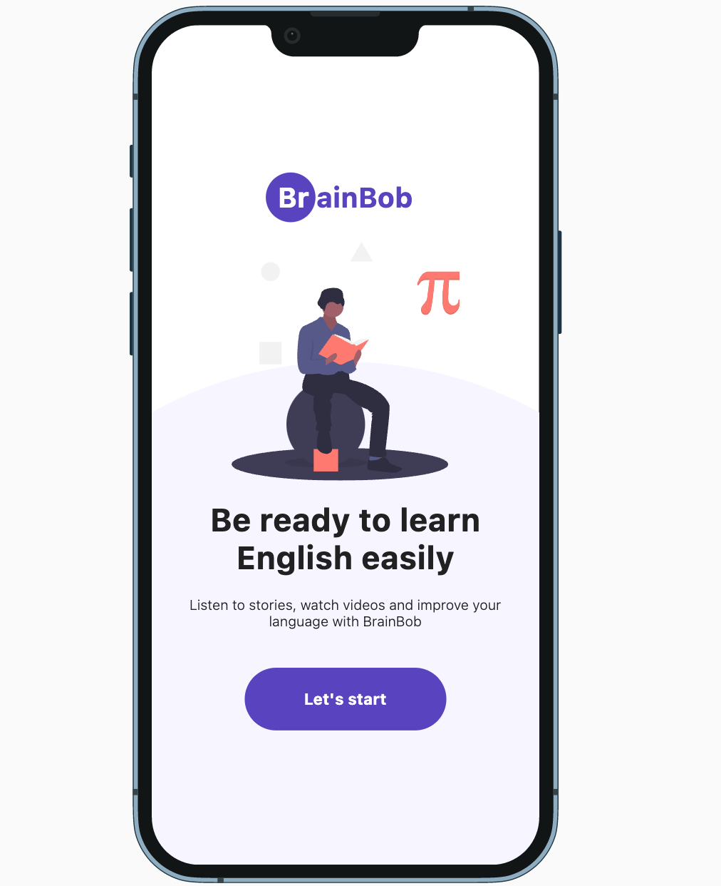
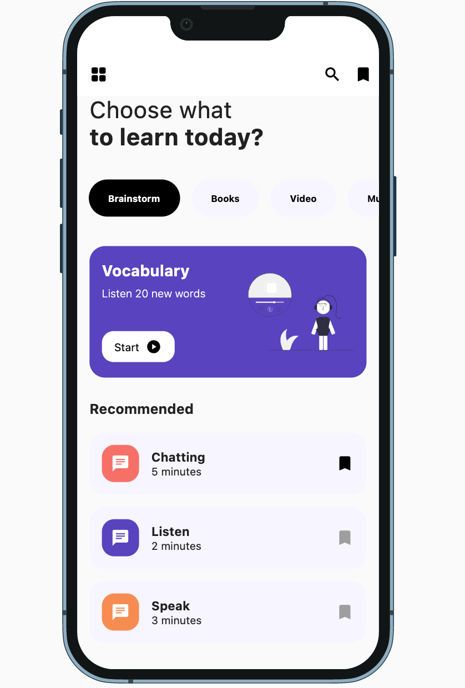

# flutter_ui_challenges

Preview: https://flutter-ui-chall.web.app/

A playground for building UIs!

## Animated Clock
Animated clock created with [CustomPaint](https://api.flutter.dev/flutter/widgets/CustomPaint-class.html).

## BrainBob

Implementation of [cool design from Dribble](https://dribbble.com/shots/15865091-The-Brainbob-mobile-app).

Solarized dark             |  Solarized Ocean
:-------------------------:|:-------------------------:
 | 
 

